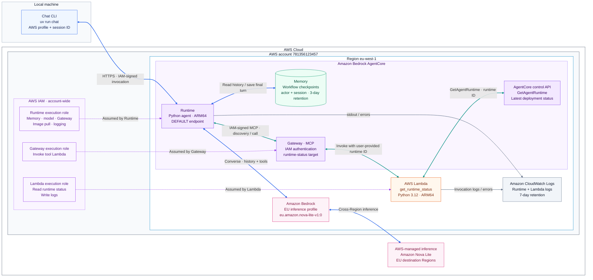

# AgentCore playground

A small project for learning Amazon Bedrock AgentCore through a text conversation.
You ask questions in a local Python CLI; an agent hosted in AWS replies using
Amazon Nova Lite, remembers follow-ups through short-term Memory, and can call
one shared tool through Gateway.

The experiment focuses on Runtime, Memory, Gateway, and the IAM permissions
connecting them. It has no RAG, UI, summaries, or long-term memory strategies.
The earlier voice prototype remains local-only in the ignored `voice/` folder.

## How the project fits together

- **Chat CLI:** runs on your machine and sends messages with a conversation ID.
- **AgentCore Runtime:** runs the Python agent in an ARM64 container.
- **LangChain:** runs the model/tool loop inside the container using Bedrock Converse.
- **AgentCore Memory:** stores LangGraph conversation/workflow checkpoints independently of runtime compute.
- **Amazon Bedrock:** generates replies with the configured Nova Lite inference profile.
- **AgentCore Gateway:** exposes the runtime-status Lambda as an IAM-authenticated MCP tool.
- **CDK infrastructure:** builds, provisions, and connects the application resources.

The agent retrieves the conversation, discovers Gateway tools, and calls the
model. If the model requests runtime status, the agent calls the tool and gives
its result back to the model. Only the original user message and completed final
reply are saved in Memory.

The status tool reads deployment readiness for a runtime ID supplied by the
user. `READY` does not establish that chat, model access, or memory are healthy.
The model runs on AWS-managed Bedrock infrastructure, outside the agent container.

## Where to go next

| Directory | What it owns | Documentation |
| --- | --- | --- |
| `infra/` | CDK stack, resources, permissions, and deployment | [Setup, deploy, and cleanup](infra/README.md) |
| `chat/` | Terminal CLI, agent, memory client, and Gateway client | [Configure, run, and verify chat](chat/README.md) |
| `tools/` | Shared tools independent of the chat package | [Tool overview](tools/README.md) |
| `tools/runtime_status/` | Runtime-status Lambda and Gateway schema | [Tool contract and packaging](tools/runtime_status/README.md) |

Start with `infra/` to deploy the application, then use `chat/` to talk to it.
[AGENTS.md](AGENTS.md) contains the repository's implementation guidance for agents.

## Conversation and data

Follow-ups reuse a session ID. Saved events survive compute shutdown, and a
conversation can be resumed by ID. New conversations select separate history.
The CDK stack uses three-day event retention; destroying it deletes Memory and
its conversation events.

This is a single-user prototype. It does not provide authorization between
users, history trimming, or transcript export. Keep conversations short and use
synthetic data: messages persist in AWS, CloudWatch can contain request text,
and AWS calls incur charges.
