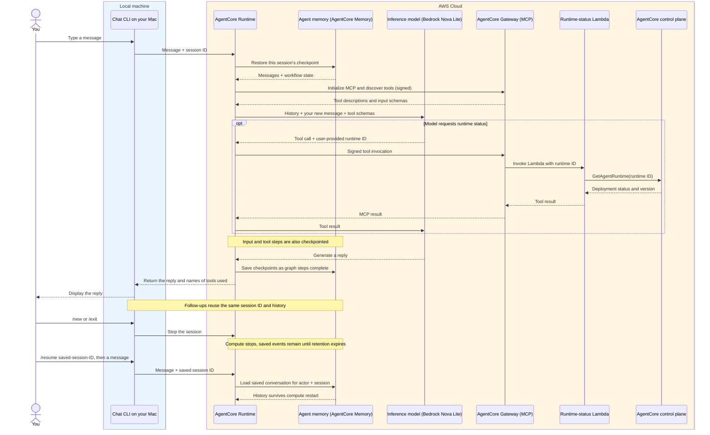

# Text chat

The local CLI invokes the hosted AgentCore `DEFAULT` endpoint. The hosted Python
agent retrieves short-term conversation history, uses LangChain with Bedrock Converse, and
uses tools discovered through Gateway. Infrastructure is managed by
[the CDK project](../infra/README.md).

## Set up and run

Requires `uv`, uv-managed Python 3.12, a configured AWS profile, and a deployed
runtime. From the repository root:

```bash
cd chat
uv python install 3.12
uv sync --locked --managed-python
```

For first-time setup, copy `.env.example` to `.env`; edit an existing `.env`
instead of overwriting it:

```bash
cp .env.example .env
```

The CLI needs only these variables:

```dotenv
AWS_PROFILE=default
AWS_REGION=eu-west-1
AGENTCORE_RUNTIME_ARN=YOUR_DEPLOYED_RUNTIME_ARN
```

Use `RuntimeArn` from `infra/outputs.json`. Its region must match `AWS_REGION`.
The profile needs `bedrock-agentcore:InvokeAgentRuntime` and
`bedrock-agentcore:StopRuntimeSession` for the runtime. CDK configures execution
roles but does not change your local caller's permissions.

Run from `chat/`:

```bash
uv run chat
```

From the repository root, use `uv run --directory chat chat`. The CLI loads
`.env` from its working directory without overriding exported shell values.
There are no configuration flags or direct Bedrock mode.

## Conversation commands

| Input | Behavior |
| --- | --- |
| A message | Send it using the current UUID session ID |
| `/session` | Display the current session ID |
| `/new` | Attempt to stop the old compute session and select a fresh UUID |
| `/resume <UUID>` | Attempt to stop the current session and select saved history |
| `/exit`, Ctrl+C, or EOF | Quit and attempt to stop the invoked compute session |

History loads on the next message after `/resume`. An unknown UUID starts with
empty history. `/new` does not delete previous events. Failed cleanup can leave
compute running until timeout. Blank input is ignored, and request errors are
printed without ending the conversation.

## How a turn works



The CLI sends `{"prompt":"..."}` and receives
`{"reply":"...","tools_used":[...]}`. It displays a complete reply rather than
streaming tokens, and prints `Tool: <name>` for completed tool calls, including
tool-level errors.

The agent opens an IAM-signed MCP connection through LangChain's `MCPAdapter`
and discovers callable tools. Nova receives short names; `get_runtime_status`
maps back to `runtime-status___get_runtime_status`. FastMCP owns initialization,
pagination, and tool protocol handling; our transport signs each request with
current execution-role credentials. Alias collisions are rejected and HTTP
connections close on exit or failed initialization. The MCP adapter API is beta.

`langchain.agents.create_agent` runs the loop with `ChatBedrockConverse`, the
configured Nova model, temperature `0`, and a `3000`-token output limit.
`CompletionGuard` validates responses inside the model node before they can be
checkpointed. Only non-empty `end_turn` replies become final answers; thinking
blocks and intermediate model text are removed. Incomplete generation, invalid
calls, unknown aliases, and duplicate/missing tool-call IDs abort the step.

LangChain's `ToolCallLimitMiddleware(run_limit=4, exit_behavior="error")`
allows at most four calls per request. Calls run sequentially. An excessive
batch is rejected before executing any tool in that batch, although earlier
batches may already have run. Tool-level errors return to the model as failed
`ToolMessage`s; transport/protocol exceptions abort the request. `GatewayTools`
middleware records original Gateway names for the CLI.

### Checkpoint memory and failed turns

`AgentCoreMemorySaver` stores LangGraph checkpoints in AgentCore Memory. The
configured actor and CLI session UUID map to `actor_id` and `thread_id`.
A checkpoint includes conversation messages, tool calls/results, and workflow
state. LangGraph restores that state for follow-ups and `/resume`; the agent
supplies only the new user message. No long-term memory strategies are enabled.

Sessions without a LangGraph checkpoint start fresh, even if old user/assistant
conversation events exist for that session. Those old events are ignored and
expire through the existing retention policy. Existing checkpoints continue to
provide history for follow-ups and `/resume`.

This changes failure behavior: the input and completed earlier steps may be
saved even when a request fails. A rejected incomplete model reply is never
saved, but the pending user message and earlier tool exchanges may remain.
An excessive tool proposal can be checkpointed before the limit middleware
rejects execution. Memory errors surface without a fallback; synchronous
checkpoint durability waits for writes before advancing to the next step.

The application submits new prompts directly to LangGraph with its normal
checkpoint behavior, including after a failed request. There is no separate
unfinished-turn check or explicit workflow-recovery command. `/new` starts an
empty thread and does not erase old checkpoints. Unknown writes or lost responses may leave saved work
the caller did not see, and retrying a completed request can duplicate a turn.

No LangSmith account or API key is required. The project does not enable tracing,
and CLI/runtime configuration variables are unchanged.

## Hosted configuration

CDK sets these on the Runtime. The CLI neither reads nor forwards them, except
that `AWS_REGION` is also independently required by the CLI.

| Variable | Hosted use |
| --- | --- |
| `AWS_REGION` | Region for Bedrock, Memory, and Gateway requests |
| `CHAT_MODEL` | Bedrock model or inference profile |
| `AGENTCORE_MEMORY_ID` | Short-term Memory resource |
| `CHAT_ACTOR_ID` | Stable actor for this single-user experiment |
| `AGENTCORE_GATEWAY_URL` | IAM-authenticated Gateway MCP URL |

The Runtime uses execution-role credentials through boto3's normal credential
chain. Do not configure `AWS_PROFILE` on the hosted Runtime. The image excludes
`.env`, and CDK wires Memory and Gateway permissions and identifiers.

## Code map

| File | Responsibility |
| --- | --- |
| `src/agent/cli.py` | Configuration, invocation, response closure, session commands, and error logging |
| `src/agent/evaluate.py` | Local LangSmith runner, conversation execution, scoring, and exit status |
| `src/agent/eval_cases.py` | Eight readable evaluation cases with per-turn expectations |
| `src/agent/runtime.py` | SDK HTTP server and process lock around invocations |
| `src/agent/agent.py` | Checkpointed LangChain agent and Bedrock model |
| `src/agent/memory.py` | AgentCore checkpointer and session configuration |
| `src/agent/middleware.py` | Completion checks, built-in tool limit, and executed-tool reporting |
| `src/agent/gateway.py` | LangChain MCP adapter, tool aliases, and HTTP cleanup |
| `src/agent/auth.py` | AWS SigV4 request signing with refreshed credentials |
| `pyproject.toml` | Distribution `agentcore-chat`, package `agent`, and console scripts |
| `Dockerfile` | Python 3.12 ARM64 container running `chat-runtime` on port 8080 |

The process lock serializes requests only within one process. Use one caller per
conversation; it does not provide distributed locking or per-user authorization.
There is no history trimming, so long conversations can exceed model limits.
For hosted code changes, [redeploy through CDK](../infra/README.md#deploy-or-update)
and start a new session. Publishing an image alone does not update the Runtime.

### Read the code in execution order

Start with the request path rather than the framework internals:

1. `cli.main` loads local configuration. `run_conversation` reads input,
   `handle_session_command` handles slash commands, and `cli.ask` displays the
   result from `cli.invoke`, the shared AWS request function. `Conversation`
   holds the selected session ID and cleanup state.
2. `runtime.invoke` receives the message and session ID, validates them, and
   calls `Chat.ask` under the process lock.
3. `Chat.ask` bridges the synchronous Runtime handler to async `_ask`.
   Read `_ask` as: open Gateway → discover tools → build agent → invoke → return
   text. `_build_agent` contains the framework wiring.
4. `Gateway.list_tools` gives the agent callable tools with short model names.
   Connection lifecycle methods open and close MCP. Read `GatewayAuth.auth_flow`
   in `auth.py` separately to understand how AWS authenticates each request.
5. `Memory.config` connects the session UUID to a saved graph thread. LangGraph
   performs persistence through `Memory.checkpointer`; there is no manual
   transcript loader or writer.
6. `CompletionGuard` validates model responses before persistence. Its helpers
   separate response shape, final-answer cleanup, and tool-call validation.
   The built-in limit bounds calls; `GatewayTools` records returned tool results
   for the CLI display.

| Term in the code | Meaning here |
| --- | --- |
| Agent / graph | The LangChain workflow alternating model and tool steps |
| Checkpointer | Storage adapter that saves and restores workflow state |
| Thread | One conversation, identified by the CLI's session UUID |
| Middleware | Code LangChain calls around a model or tool step |
| Tool alias | Short name shown to Nova, mapped to Gateway's full name |
| `async` / `await` | Functions that can yield while waiting for network work; `asyncio.run` bridges from the synchronous entry point |

Module and method docstrings explain the purpose and important side effects.
Validation and cleanup are kept explicit because they determine what is saved,
which tools execute, and whether connections or remote sessions remain open.

## Verify the deployed application

### Run the evaluation suite

From `chat/`, using the same `.env` or shell configuration as the CLI:

```bash
uv sync --locked --managed-python
uv run chat-eval
```

This runs eight cases sequentially against the deployed `DEFAULT` endpoint:
14 chat requests in a successful full run, plus session-stop requests. It calls
AWS and incurs normal charges. Each case starts with a fresh session UUID and
uses synthetic facts. Tool cases derive the real runtime ID from your configured
`AGENTCORE_RUNTIME_ARN`; no additional environment variables are needed.

| Case | Conversation and expectation |
| --- | --- |
| `basic_greeting` | A greeting produces a non-empty reply without tools |
| `remembers_fact` | A second turn recalls the synthetic project code from the first |
| `corrects_fact` | After a correction, the third turn contains the new code and excludes the old one |
| `isolates_sessions` | After selecting a new UUID, the reply excludes the first session's code |
| `resumes_saved_fact` | After a successful stop request and selecting the saved UUID, a follow-up recalls its code |
| `missing_runtime_id` | With no runtime ID, the reply contains “runtime ID” and calls no tools |
| `runtime_status` | An explicit status request reports one `get_runtime_status` call and repeats the supplied ID |
| `runtime_status_followup` | Both turns report one status-tool call; the second prompt relies on the first turn's runtime ID |

The LangSmith SDK runs each example through `invoke_chat`, then applies three
ordinary Python evaluators to the complete conversation:

| Score | Pass condition |
| --- | --- |
| `has_replies` | Expected turn count and non-empty reply text on every turn |
| `expected_tools` | Every turn's reported tool sequence matches the example; missing reports fail |
| `expected_text` | Required fragments appear and forbidden fragments are absent, ignoring case |

Example output (reply wording can vary):

```text
PASS remembers_fact
  has_replies: PASS
    Expected: 2 turns, each with a non-empty reply
    Actual: 2 returned turns, 2 non-empty replies
  expected_tools: PASS
    Turn 1: expected []; actual []
    Turn 2: expected []; actual []
  expected_text: PASS
    Turn 2: must contain ['BLUE_KITE_42']
    Turn 2: must exclude []
    Turn 2: actual reply 'BLUE_KITE_42'
  Last reply: BLUE_KITE_42
...
8/8 cases passed
```

Scores include expected and actual values. Displayed turn numbers start at 1;
case definitions use indexes starting at 0. Empty tool lists mean no calls;
`None` means no report was returned. Expected tools use short aliases, while
actual reports show the full Gateway names; scoring ignores the Gateway prefix.
Text expectations are fragments, not exact full-response matches.

The command exits with 0 only when every case and score passes; otherwise it
exits with 1. Request errors fail their case, are recorded in the working
directory's `error.log`, and do not stop later cases. Response streams close and
final runtime cleanup is attempted even after request/parsing failures. Final
cleanup is best effort, like the CLI. The resume case additionally requires its
intermediate stop request to succeed. Stops preserve Memory checkpoints; the
synthetic evaluation conversations remain subject to Memory retention.

These are targeted regression checks, not a semantic judge. In particular,
excluding a code does not prove a truthful isolation answer, mentioning “runtime ID” does
not prove a helpful clarification, and a reported tool call does not verify its
arguments or successful result. An accepted stop request does not prove a new
worker process was started. Check those details through the manual acceptance
checks below. Text checks can flag a valid response with unexpected wording;
inspect the final reply before deciding whether behavior or expectations need
changing.

The dataset, results, and traces stay local: experiment uploads and background
trace uploading are disabled. No LangSmith API key, account, or judge model is
required. The SDK may print a beta warning for its local-results option.

For learning, read `eval_cases.py` first: each example pairs prompts with expected
behavior. In `evaluate.py`, `invoke_chat` sends those prompts and manages the
session, the three evaluators compare actual output to expectations, and
`run_evaluation`/`main` run the suite and print scores. To add a case, append one
input/expectation pair in `eval_cases.py`; keep one expected tool list per prompt.
`contains` and `excludes` use zero-based turn indexes. Optional `session_action`
is `new` or `resume` and applies just before the final prompt of a multi-turn case.

The suite evaluates whichever Runtime version is deployed. Local hosted-code
edits require CDK redeployment before this command can assess them. Adding or
changing these local evaluation files alone requires no cloud deployment.

### Manual acceptance checks

These checks call AWS and incur charges. Use `uv run chat` after deployment:

1. Send a greeting and confirm a normal reply without a tool call.
2. Provide a synthetic fact and confirm a follow-up recalls it.
3. Save `/session`, exit, restart the CLI, and `/resume <UUID>`; confirm the fact
   persists. Repeat after runtime compute restarts when checking persistence.
4. Use `/new`; confirm the previous fact is not available.
5. Ask for deployment status using the actual `RuntimeId` from CDK outputs.
   Confirm `Tool: runtime-status___get_runtime_status` appears.
6. Ask “Check its status again”; confirm it reuses the ID from history.
7. In a fresh conversation, ask for status without an ID; the agent should ask
   for one. A nonexistent valid-format ID should produce a tool failure, not a
   claim that the runtime is `READY`.

8. A rejected incomplete reply must never appear in saved assistant history.
   After a failure, check a follow-up and use `/new` when fresh state is desired.

The runtime-status tool takes an ID, not the CLI's ARN. See
[its contract](../tools/runtime_status/README.md#tool-contract).

## Troubleshooting

Request and cleanup errors append to `error.log` in the working directory,
including timestamp, session ID, and traceback. The CLI does not deliberately
log prompts, replies, or credentials. Log files are ignored by Git.
A generic AWS 500 cannot reveal a server exception that the SDK did not return;
inspect `/aws/bedrock-agentcore/runtimes/<runtime-id>-DEFAULT`, especially
`[runtime-logs]` streams, for the hosted exception.

| Symptom | Check |
| --- | --- |
| Missing CLI environment variable | The three variables in `.env`, the working directory, and exported shell values |
| Runtime invocation or cleanup denied | Local caller permissions on the new runtime ARN |
| Missing hosted variable or Memory access failure | CDK Runtime settings and execution role; Memory must be active in the same region |
| Gateway HTTP 403 | Runtime role's `bedrock-agentcore:InvokeGateway` permission |
| No Gateway tools | Gateway and Lambda target readiness |
| Lambda tool failure | Gateway role's invocation permission, Lambda's runtime-read permission, and the supplied ID |
| `ResourceNotFoundException` from the tool | Use the actual `RuntimeId`; schema examples and retired IDs are not deployed resources |
| Nova invalid tool-use sequence | Confirm short model-facing names, temperature `0`, and the `3000`-token output limit are deployed |
| Model did not complete its reply | The reported stop reason, such as `max_tokens`; the rejected reply was not saved, but input/earlier steps may remain. Use `/new` if the thread is unfinished |

If a Homebrew upgrade broke the Python environment, recreate only the generated
virtual environment using uv-managed Python, from `chat/`:

```bash
uv python install 3.12
uv venv --clear --python 3.12 --managed-python .venv
uv sync --locked --managed-python
```

## Optional local HTTP check

`chat-runtime` starts the SDK server locally. It still calls live Bedrock,
Memory, and Gateway; this is not an offline check or hosted deployment test.
Add the five hosted variables above to your local `.env` and use local
credentials permitted to call the model, Memory, and Gateway.

From `chat/`:

```bash
uv run chat-runtime
```

In another terminal:

```bash
curl http://localhost:8080/ping
curl http://localhost:8080/invocations \
  -H 'Content-Type: application/json' \
  -H 'X-Amzn-Bedrock-AgentCore-Runtime-Session-Id: 11111111-1111-4111-8111-111111111111' \
  -d '{"prompt":"Remember the synthetic tag blue-kite."}'
```

Reuse the header's UUID for follow-ups; change it for empty history.
The local HTTP server is a diagnostic entry point; `uv run chat` remains the
normal interface for checking the deployed agent.

References: [AgentCore checkpoint integration](https://docs.aws.amazon.com/bedrock-agentcore/latest/devguide/memory-integrate-lang.html),
[LangSmith local evaluations](https://docs.langchain.com/langsmith/local),
[LangChain MCP](https://docs.langchain.com/oss/python/langchain/mcp),
[Runtime permissions](https://docs.aws.amazon.com/bedrock-agentcore/latest/devguide/runtime-permissions.html),
[LangChain agents](https://docs.langchain.com/oss/python/langchain/agents),
[LangChain middleware](https://docs.langchain.com/oss/python/langchain/middleware/custom),
[Session behavior](https://docs.aws.amazon.com/bedrock-agentcore/latest/devguide/runtime-sessions.html),
[Nova tool troubleshooting](https://docs.aws.amazon.com/nova/latest/userguide/tools-troubleshooting.html).
