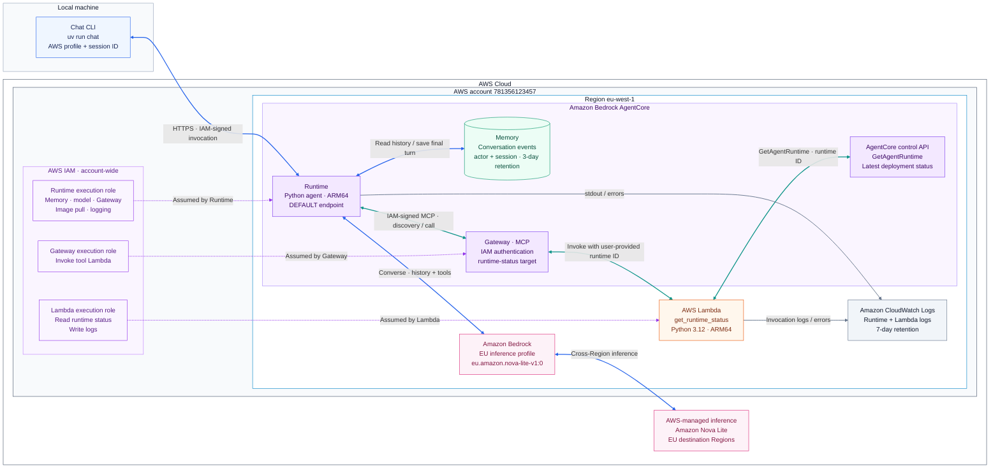

# AWS architecture

This diagram describes the infrastructure defined by CDK, rather than a verified
live deployment. All application resources are created fresh, including Memory.
The account boundary represents resource ownership and IAM scope, not a VPC.
The Runtime uses public networking with IAM authentication.

## Chat and tool execution

Blue connections carry chat, memory, and inference requests. Teal connections
carry tool requests. Purple dotted connections associate execution roles with
resources. Grey connections carry logs. Requests and their responses share the
same connection, so bidirectional arrows represent both directions.

The agent loads its conversation before inference. The model can request a tool,
then receives its result before producing the final reply. Only the user's
message and final reply enter Memory. Tool calls remain within that turn.
`READY` from the status tool describes deployment readiness, not chat health.
The model executes on AWS-managed Bedrock infrastructure; it is not deployed
inside our Runtime. The EU inference profile can route to another EU Region.

## Build and deployment

The application stack and the CDK bootstrap stack have different ownership and
cleanup boundaries. Orange dashed connections show deployment operations, not
traffic during a chat. Docker and uv packaging run on the developer's machine.

```mermaid
flowchart LR
    subgraph LOCAL["Local machine · deployment"]
        SOURCE["Repository<br/>chat/ + tools/runtime_status/ + infra/"]
        CDK["CDK CLI + Python definitions<br/>Docker builds ARM64 image<br/>uv packages Lambda"]
        SOURCE --> CDK
    end

    subgraph AWS["AWS account 781356123457 · eu-west-1"]
        subgraph BOOTSTRAP["CDKToolkit · bootstrap stack"]
            ECR["Amazon ECR<br/>Bootstrap staging repository"]
            S3["Amazon S3<br/>Lambda + template assets"]
            ROLES["AWS IAM<br/>Deployment / asset roles"]
        end
        CF["AWS CloudFormation<br/>Create / update application stack"]
        subgraph APP["AgentCoreChatDev · application stack"]
            APP_ECR["Amazon ECR<br/>agentcore-chat-cdk<br/>Explicit repository resource"]
            COPY["Image deployment helper<br/>Copy ARM64 image + source-hash tag"]
            RUNTIME["AgentCore Runtime"]
            LAMBDA["AWS Lambda tool"]
            SERVICES["AgentCore Memory + Gateway / target<br/>IAM execution roles<br/>CloudWatch log configuration"]
        end
    end

    CDK -.->|"Publish container image"| ECR
    CDK -.->|"Upload packaged assets"| S3
    CDK -.->|"Deploy template using bootstrap roles"| CF
    ROLES -.->|"Deployment permissions"| CF
    CF -.->|"Provision and wire resources"| SERVICES
    CF -.->|"Create / update Runtime"| RUNTIME
    CF -.->|"Create / update Lambda"| LAMBDA
    CF -.->|"Create application repository"| APP_ECR
    CF -.->|"Publish image before Runtime"| COPY
    ECR -.->|"Source image"| COPY
    COPY -.->|"Copy image"| APP_ECR
    APP_ECR -->|"Runtime pulls image"| RUNTIME
    S3 -->|"Lambda deployment package"| LAMBDA

    classDef local fill:#EFF6FF,stroke:#2563EB,color:#172554
    classDef assets fill:#ECFDF5,stroke:#059669,color:#064E3B
    classDef deploy fill:#FFF7ED,stroke:#EA580C,color:#7C2D12
    classDef application fill:#F3E8FF,stroke:#7C3AED,color:#3B0764
    classDef iam fill:#FAF5FF,stroke:#9333EA,color:#581C87
    class SOURCE,CDK local
    class ECR,S3,APP_ECR assets
    class CF,COPY deploy
    class RUNTIME,LAMBDA,SERVICES application
    class ROLES iam
    style LOCAL fill:#F8FAFC,stroke:#94A3B8,color:#0F172A
    style AWS fill:#FFFFFF,stroke:#475569,color:#0F172A
    style BOOTSTRAP fill:#F0FDF4,stroke:#059669,color:#064E3B
    style APP fill:#FAF5FF,stroke:#7C3AED,color:#3B0764
    linkStyle 1,2,3,4,5,6,7,8,9,10,11 stroke:#EA580C,stroke-width:1.5px
    linkStyle 12,13 stroke:#059669,stroke-width:2px
```

`cdk destroy` removes the application stack, including its Memory and conversation
events, plus the application ECR repository and images. Bootstrap staging
repositories, uploaded assets, and deployment helpers' own logs remain outside
that cleanup. The old manually created resources are
not part of this CDK deployment. See [deployment and cleanup](../infra/README.md).

For message-by-message ordering, see [the chat sequence diagram](chat-flow.md).
