# CDK infrastructure

Deploy the text agent and shared runtime-status tool with one Python CDK stack.
See [the project overview](../README.md#how-the-project-fits-together) for the runtime architecture.
Run commands below from `infra/` unless a block starts from the repository root.
Source stays in `chat/` and
`tools/runtime_status/`; infrastructure imports neither application's package.

## Resources

`AgentCoreChatDev` targets account `781356123457`, region `eu-west-1`:

- ARM64 Runtime named `agentcore_chat_cdk`, built from the existing Dockerfile.
- Application ECR repository named `agentcore-chat-cdk`, explicitly created in `services/ecr.py`.
- New short-term Memory named `agentcore_chat_cdk_memory`, with three-day event retention.
- IAM-authenticated Gateway `agentcore-chat-cdk-tools` and `runtime-status` target.
- Python 3.12 ARM64 Lambda, packaged with the shared tool's SDK requirements.
- Execution roles and model, Memory, Gateway, Lambda, ECR, and logging permissions.
- Seven-day retention for Lambda logs and the runtime's default log group.

The first deployment creates all application resources from scratch.
This stack does not import existing application resources. The Lambda's
generated name is printed as an output.

The new Memory starts empty. Old conversations are not copied or reused.
CDK passes the new Memory ID directly to the new Runtime and scopes its IAM
permissions to that resource. Memory is deleted with the stack, including all
conversation events, so destroying and redeploying starts fresh again.
Image deployment has an explicit order:

1. CDK builds and uploads the ARM64 image to its bootstrap ECR staging repository.
2. CloudFormation creates the application repository `agentcore-chat-cdk`.
3. An image-copy deployment helper copies the image into that repository, tagged
   with its source hash.
4. The Runtime is created or updated using the application repository's image URI.

The bootstrap staging repository is created separately by `cdk bootstrap`.
`services/ecr.py` contains the application repository creation and image-copy
definition.

### Deployment flow

```mermaid
flowchart LR
    subgraph LOCAL["Local machine · deployment"]
        SOURCE["Repository<br/>chat/ + tools/runtime_status/ + infra/"]
        CDK["CDK CLI + Python definitions<br/>Docker builds ARM64 image<br/>uv packages Lambda"]
        SOURCE --> CDK
    end

    subgraph AWS["AWS account 781356123457 · eu-west-1"]
        subgraph BOOTSTRAP["CDKToolkit · bootstrap stack"]
            ECR["Amazon ECR<br/>Bootstrap staging repository"]
            S3["Amazon S3<br/>Lambda + template assets"]
            ROLES["AWS IAM<br/>Deployment / asset roles"]
        end
        CF["AWS CloudFormation<br/>Create / update application stack"]
        subgraph APP["AgentCoreChatDev · application stack"]
            APP_ECR["Amazon ECR<br/>agentcore-chat-cdk<br/>Explicit repository resource"]
            COPY["Image deployment helper<br/>Copy ARM64 image + source-hash tag"]
            RUNTIME["AgentCore Runtime"]
            LAMBDA["AWS Lambda tool"]
            SERVICES["AgentCore Memory + Gateway / target<br/>IAM execution roles<br/>CloudWatch log configuration"]
        end
    end

    CDK -.->|"Publish container image"| ECR
    CDK -.->|"Upload packaged assets"| S3
    CDK -.->|"Deploy template using bootstrap roles"| CF
    ROLES -.->|"Deployment permissions"| CF
    CF -.->|"Provision and wire resources"| SERVICES
    CF -.->|"Create / update Runtime"| RUNTIME
    CF -.->|"Create / update Lambda"| LAMBDA
    CF -.->|"Create application repository"| APP_ECR
    CF -.->|"Publish image before Runtime"| COPY
    ECR -.->|"Source image"| COPY
    COPY -.->|"Copy image"| APP_ECR
    APP_ECR -->|"Runtime pulls image"| RUNTIME
    S3 -->|"Lambda deployment package"| LAMBDA

    classDef local fill:#EFF6FF,stroke:#2563EB,color:#172554
    classDef assets fill:#ECFDF5,stroke:#059669,color:#064E3B
    classDef deploy fill:#FFF7ED,stroke:#EA580C,color:#7C2D12
    classDef application fill:#F3E8FF,stroke:#7C3AED,color:#3B0764
    classDef iam fill:#FAF5FF,stroke:#9333EA,color:#581C87
    class SOURCE,CDK local
    class ECR,S3,APP_ECR assets
    class CF,COPY deploy
    class RUNTIME,LAMBDA,SERVICES application
    class ROLES iam
    style LOCAL fill:#F8FAFC,stroke:#94A3B8,color:#0F172A
    style AWS fill:#FFFFFF,stroke:#475569,color:#0F172A
    style BOOTSTRAP fill:#F0FDF4,stroke:#059669,color:#064E3B
    style APP fill:#FAF5FF,stroke:#7C3AED,color:#3B0764
    linkStyle 1,2,3,4,5,6,7,8,9,10,11 stroke:#EA580C,stroke-width:1.5px
    linkStyle 12,13 stroke:#059669,stroke-width:2px
```



## File layout

`app.py` selects the account/region. `stack.py` wires the services and outputs.

| File | AWS resources |
| --- | --- |
| `services/agentcore.py` | AgentCore Memory, Runtime, Gateway, and target |
| `services/lambda_service.py` | Lambda function and uv packaging |
| `services/iam.py` | Roles and permission policies |
| `services/ecr.py` | Application ECR repository, ARM64 image asset, and image publication |
| `services/cloudwatch.py` | Log groups, retention, and cleanup |

## One-time setup

Requires `uv`, Node.js 22+, Docker Desktop running, and your working AWS profile.
The CDK CLI is pinned locally; no global CDK installation is needed.
From the repository root:

```bash
cd infra
uv python install 3.12
uv sync --locked --managed-python
npm ci
export AWS_PROFILE=default
export AWS_REGION=eu-west-1
```

CDK uses your profile directly and does not load `chat/.env`.
Confirm your profile belongs to the account selected in `cdk.json`. With a
working AWS CLI, run:

```bash
aws sts get-caller-identity --profile "$AWS_PROFILE" --region "$AWS_REGION"
```

On this Mac, use `/usr/local/bin/aws` if the Homebrew AWS CLI fails with
`pyexpat` / `libexpat` errors.

`cdk.json` selects the target account/region, actor, and Nova Lite inference
profile. Model IAM permissions cover Nova Lite; changing to another model also
requires updating its resource ARNs in `services/iam.py`.

Bootstrap once per account/region, unless already bootstrapped:

```bash
npx cdk bootstrap aws://781356123457/eu-west-1 --profile "$AWS_PROFILE"
```

Bootstrap creates CDK deployment roles, an S3 asset bucket, and an ECR asset
repository. Use a profile authorized to bootstrap/deploy. CDK uses
CloudFormation and bootstrap roles; it does not bypass IAM restrictions.

After bootstrapping, the caller also needs `sts:AssumeRole` on these four roles
in account `781356123457`: `cdk-hnb659fds-deploy-role-781356123457-eu-west-1`,
`cdk-hnb659fds-file-publishing-role-781356123457-eu-west-1`,
`cdk-hnb659fds-image-publishing-role-781356123457-eu-west-1`, and
`cdk-hnb659fds-lookup-role-781356123457-eu-west-1`.
Configure this once through an authorized IAM administrator, before deploying
the application stack. Bootstrap does not grant these permissions to the caller.
Without them, CDK can fall back to the caller's own permissions and fail to
access the bootstrap asset bucket. The deployment role passes the configured
CloudFormation execution role, which uses `AdministratorAccess` by default.

## Deploy or update

```bash
npx cdk synth --quiet
npx cdk diff --profile "$AWS_PROFILE" --no-change-set
npx cdk deploy AgentCoreChatDev --profile "$AWS_PROFILE" --outputs-file outputs.json
```

Synthesis generates a template and bundles Lambda dependencies using `uv`.
It can download packages, but creates no AWS resources. Diff reads deployed
stack information; `--no-change-set` avoids creating a CloudFormation change set.
Deploy builds the ARM64 image, publishes image and Lambda assets, and creates or
updates the stack, including the explicit ECR repository and image publication.
The copy helper uses `cdk-ecr-deployment`, as recommended in the
[AWS image assets documentation](https://docs.aws.amazon.com/cdk/api/v2/python/aws_cdk.aws_ecr_assets/README.html).
CDK uses source hashes instead of a mutable `latest` image tag. `RepositoryUri`
and `ImageUri` outputs show the application repository and the Runtime's image.
No separate ZIP, ECR login/push, application-role policy commands, or console
runtime update are required. AgentCore updates `DEFAULT` to the latest version; start a new chat
session after an update to use the new version.

For normal updates, repeat diff and deploy. Change code and redeploy instead of
editing stack-managed resources in the console.

## Deployment outputs

`outputs.json` is generated locally and ignored by Git.

| Output | Use |
| --- | --- |
| `RuntimeArn` | `AGENTCORE_RUNTIME_ARN` for the local chat CLI |
| `RuntimeId` | ID to supply when asking the runtime-status tool |
| `GatewayUrl`, `MemoryId` | Resources CDK already configured on the hosted Runtime |
| `LambdaName` | Find the deployed tool Lambda |
| `RepositoryUri`, `ImageUri` | Application image repository and deployed image |

From `infra/`, inspect the outputs and export the new Runtime ARN:

```bash
cat outputs.json
export AGENTCORE_RUNTIME_ARN=$(uv run --locked --managed-python python -c \
  'import json; print(json.load(open("outputs.json"))["AgentCoreChatDev"]["RuntimeArn"])')
```

Keep `AWS_PROFILE` and `AWS_REGION` exported, then follow
[the chat setup and run commands](../chat/README.md#set-up-and-run).
Alternatively, put the ARN in `chat/.env`. Shell values take precedence.
The caller needs invocation and cleanup permissions for the new Runtime ARN;
this stack does not modify the local IAM user's policies.

## Deployment troubleshooting

| Symptom | Resolution |
| --- | --- |
| Bootstrap cannot write its SSM version parameter | Fix the bootstrap caller or CloudFormation service role's SSM permissions before retrying |
| `CDKToolkit` is `UPDATE_ROLLBACK_FAILED` | Correct the denied permissions, continue the rollback, and wait for `UPDATE_ROLLBACK_COMPLETE` before retrying bootstrap |
| Cannot assume a CDK role; proceeding with default credentials | Check the caller's `sts:AssumeRole` permissions and the role trust policy |
| Bootstrap asset bucket exists but is inaccessible | Ensure CDK can assume the file-publishing role; creating another bucket is not the fix |
| Image build succeeds but asset publication fails | Read the earlier publishing error; check bootstrap-role access before changing the Dockerfile |

Bootstrap is a one-time account/region setup, separate from deploying the
application. Permissions to assume its roles are caller access setup, and cannot
be supplied by an application stack that the caller is not yet allowed to deploy.

## Cleanup

From `infra/`:

```bash
npx cdk destroy --profile "$AWS_PROFILE"
```

This removes the stack's Runtime, Gateway/target, tool Lambda, execution roles,
Lambda log group, runtime default log group, and Memory with all conversation
events. It also empties and deletes the application ECR repository, including
its images. Resources outside the application stack remain.

The shared `CDKToolkit` bootstrap stack, its asset bucket/repository, uploaded
assets, and deployment helpers' own Lambda logs are outside this cleanup.
They can retain storage charges. Check them separately when retiring this
experiment; do not delete shared bootstrap resources used by other applications.
Additional log destinations enabled manually are outside this stack.

## Verification

Local synthesis checks the template, IAM/resource wiring, tool schema, Lambda
packaging, and asset manifests. Deployment and hosted chat must be verified
separately. Run [the chat acceptance checks](../chat/README.md#verify-the-deployed-application)
through `uv run chat` to verify the deployed model, Memory, and Gateway flow.
Current verification status is recorded in [AGENTS.md](../AGENTS.md#verification-status).

References: [CDK assets](https://docs.aws.amazon.com/cdk/v2/guide/assets.html),
[CDK bootstrapping](https://docs.aws.amazon.com/cdk/v2/guide/bootstrapping.html),
[AgentCore CDK resources](https://docs.aws.amazon.com/cdk/api/v2/python/aws_cdk.aws_bedrockagentcore.html),
[Runtime permissions](https://docs.aws.amazon.com/bedrock-agentcore/latest/devguide/runtime-permissions.html).
